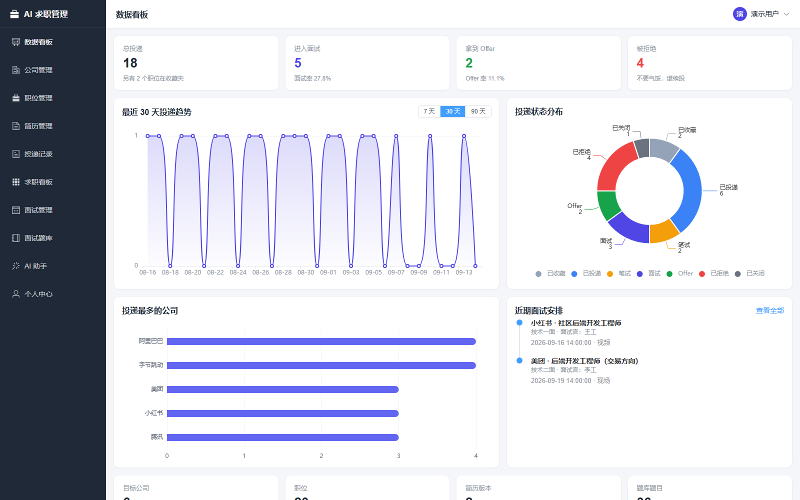
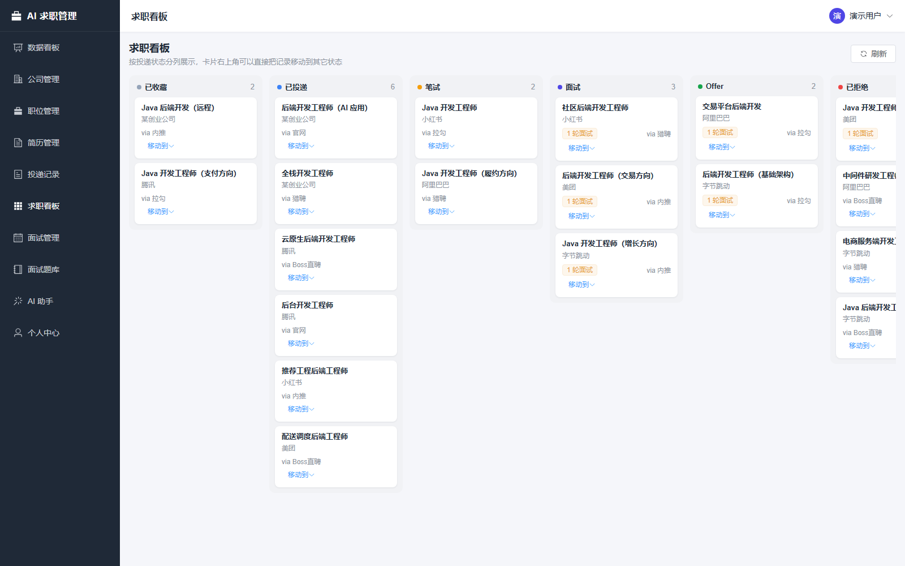
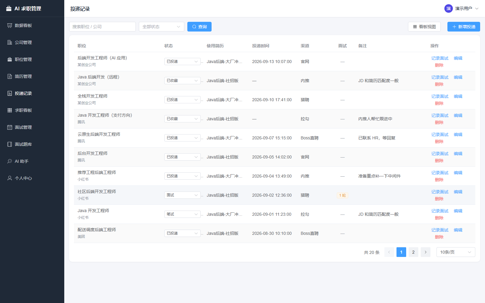
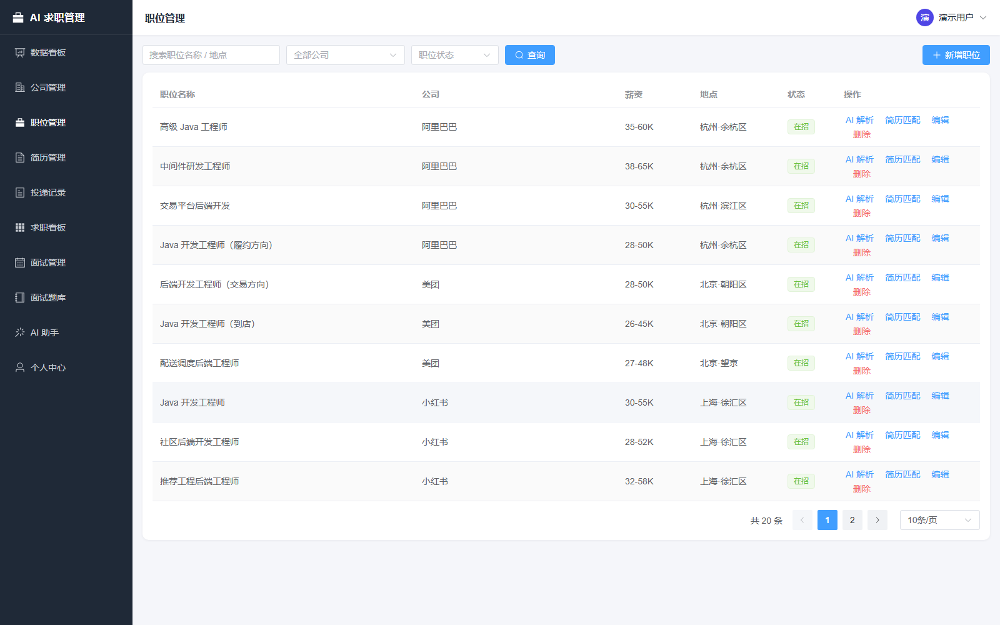
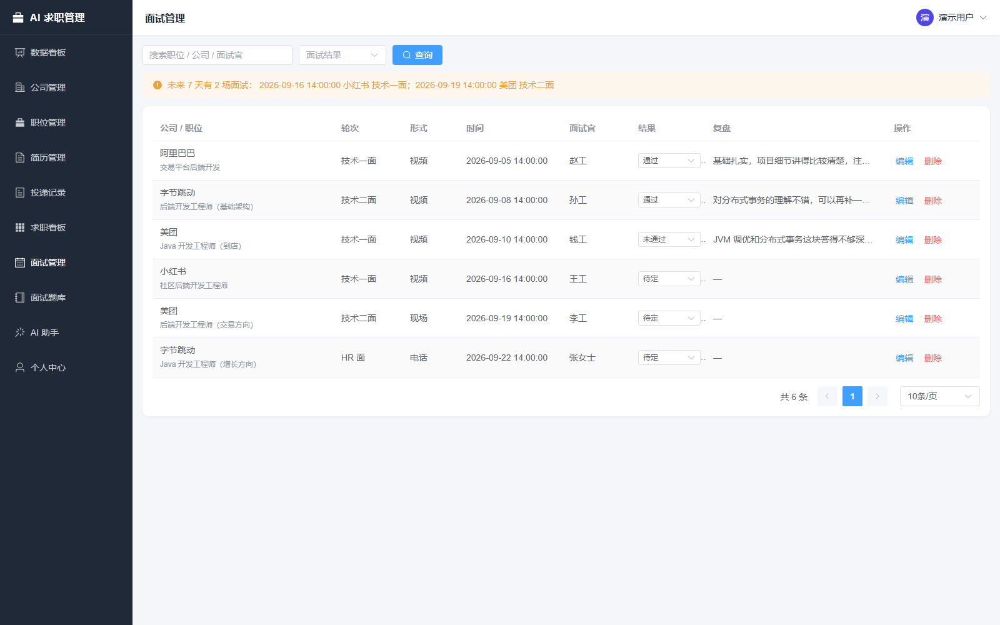
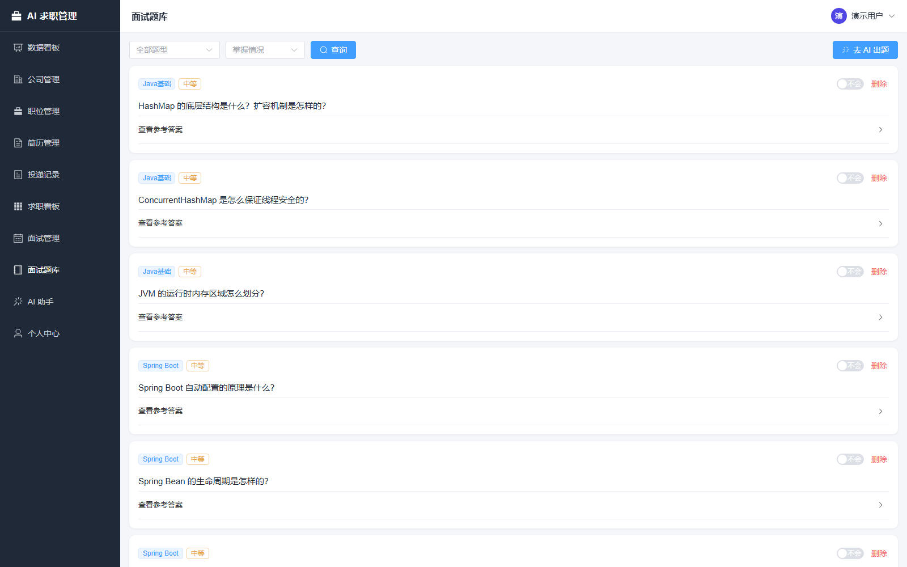
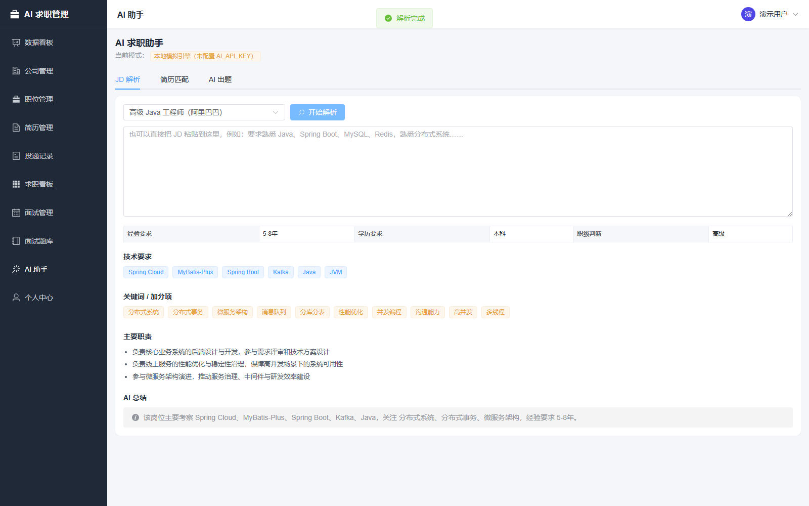
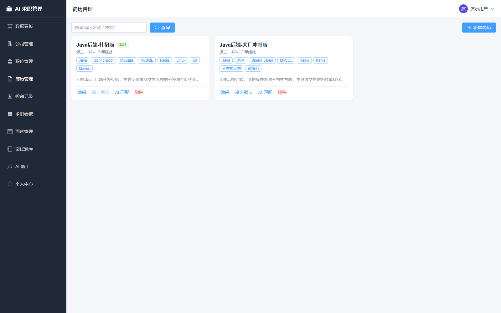

# AI 求职管理平台（AI Job Assistant）

一个把「找工作」全流程串起来的个人项目：**公司 → 职位 → 简历 → 投递 → 面试 → Offer**，
并接入大模型做 **JD 解析、简历匹配度分析、面试题生成**。

不是零散的功能堆砌，而是一条完整的求职闭环；也不只是一个 CRUD 系统 —— AI 结果会落库、
被引用、被统计，形成可回看的数据资产。

> 技术栈：Spring Boot 3 + MyBatis-Plus + MySQL 8 + Spring Security / JWT + Vue 3 + Element Plus + ECharts

---

## 目录

- [项目亮点](#项目亮点)
- [功能截图](#功能截图)
- [技术栈](#技术栈)
- [系统架构](#系统架构)
- [快速开始](#快速开始)
- [AI 能力说明](#ai-能力说明)
- [数据库设计](#数据库设计)
- [接口概览](#接口概览)
- [项目结构](#项目结构)
- [测试](#测试)
- [常见问题](#常见问题)
- [后续规划](#后续规划)

---

## 项目亮点

| 亮点 | 说明 |
| --- | --- |
| **完整业务闭环** | 投递记录是核心聚合根，串起公司、职位、简历、面试、AI 分析，而不是互不相干的单表 CRUD |
| **状态机驱动** | 投递有 7 个状态（收藏 / 已投递 / 笔试 / 面试 / Offer / 已拒绝 / 已关闭），新增面试会自动把投递推进到「面试」，标记面试未通过会自动置为「已拒绝」 |
| **看板视图** | 7 列拖拽式求职看板（`/board`），一眼看清每个岗位卡在哪个环节 |
| **AI 降级设计** | 没配 `ai.api-key` 时自动走本地模拟引擎，用技术词典 + 正则做规则抽取，**输出结构与真实大模型完全一致**，项目开箱即可跑通全流程 |
| **AI 结果落库** | 每次 JD 解析 / 简历匹配都会写入 `ai_analysis`，生成的面试题会进题库，可回看、可统计 |
| **统一响应与异常** | `Result<T>` + `PageResult<T>` + `ErrorCode` 枚举 + 全局异常处理器，接口返回结构前后端一致 |
| **分层清晰** | `controller / service / service.impl / mapper / entity / dto / vo / ai / security / config / common`，DTO 与 VO 分离，实体不外泄 |
| **多租户数据隔离** | 所有业务查询都带 `user_id`，越权访问统一返回业务错误码，不会拿到别人的数据 |

---

## 功能截图

| 数据看板 | 求职看板 |
| --- | --- |
|  |  |

| 投递记录 | 职位管理 |
| --- | --- |
|  |  |

| 面试管理 | 面试题库 |
| --- | --- |
|  |  |

| AI 助手 | 简历管理 |
| --- | --- |
|  |  |

---

## 技术栈

### 后端

| 技术 | 版本 | 用途 |
| --- | --- | --- |
| Java | 17 | 语言版本（用到 record、switch 表达式、文本块） |
| Spring Boot | 3.2.5 | 基础框架 |
| Spring Security | 6.x | 认证与鉴权 |
| JJWT | 0.12.5 | JWT 生成与校验 |
| MyBatis-Plus | 3.5.5 | ORM、分页、逻辑删除 |
| MySQL | 8.0 | 数据库 |
| Knife4j (OpenAPI 3) | 4.5.0 | 接口文档 |
| Lombok | - | 简化样板代码 |
| Maven | 3.9 | 构建 |

### 前端

| 技术 | 版本 | 用途 |
| --- | --- | --- |
| Vue | 3.5 | 框架（组合式 API + `<script setup>`） |
| Vite | 5 | 构建工具 |
| Element Plus | 2.8 | UI 组件库 |
| Pinia | 2.x | 状态管理 |
| Vue Router | 4.x | 路由（hash 模式） |
| Axios | 1.x | HTTP 请求，拦截器统一注入 token |
| ECharts | 5.x | 趋势折线图、状态饼图、Top 公司柱状图 |

> 第一版**刻意没有引入 Redis / Docker / 消息队列**，目的是让项目 clone 下来就能跑通。
> 这些属于「后续规划」里的加分项，不是跑通全流程的必要条件。

---

## 系统架构

```
┌─────────────────────────────────────────┐
│              Vue 3 + Vite               │
│   登录 / 看板 / 公司 / 职位 / 简历 /     │
│   投递 / 面试 / 题库 / AI 助手 / 个人中心 │
└────────────────────┬────────────────────┘
                     │ HTTP + JWT
                     ▼
┌─────────────────────────────────────────┐
│            Spring Boot 3 (8088)         │
│                                         │
│  Controller ── DTO/VO ── 参数校验        │
│      │                                  │
│  Service ── 业务规则 / 状态机 / 事务      │
│      │            │                     │
│  Mapper      AiService ── AiClient      │
│  (MyBatis-    │            │            │
│   Plus)       │            ├─ 有 key → 大模型 API
│      │        │            └─ 无 key → MockAiEngine
│      ▼        ▼                         │
│   MySQL   ai_analysis / interview_question
│                                         │
│  Spring Security + JwtFilter ── 认证鉴权 │
│  GlobalExceptionHandler ── 统一异常      │
└─────────────────────────────────────────┘
```

---

## 快速开始

### 环境要求

- JDK 17 及以上
- Maven 3.8+
- MySQL 8.0+
- Node.js 18+ 与 npm

### 1. 初始化数据库

```bash
mysql -uroot -p < sql/schema.sql
```

脚本会创建 `ai_job_assistant` 数据库和 8 张表，可重复执行（会先 drop 再建）。

### 2. 启动后端

修改 `backend/src/main/resources/application.yml` 里的数据库账号密码（默认 `root/123456`）：

```yaml
spring:
  datasource:
    url: jdbc:mysql://localhost:3306/ai_job_assistant?...
    username: root
    password: 123456
```

然后启动：

```bash
cd backend
mvn spring-boot:run
```

或者打包后运行：

```bash
cd backend
mvn clean package -DskipTests
java -jar target/job-assistant-1.0.0.jar
```

后端跑在 **http://localhost:8088/api**，接口文档：**http://localhost:8088/api/doc.html**

> 端口用的是 8088 而不是 8080，因为 8080 经常被本地其它服务占用。
> 需要改端口就设环境变量 `SERVER_PORT=9090`。

### 3. 启动前端

```bash
cd frontend
npm install
npm run dev
```

浏览器打开 **http://localhost:5173**，注册一个账号即可开始使用。

### 4. 灌入演示数据（可选，但强烈建议）

空库时看板全是 0，看不出效果。启动后端后执行一次种子脚本：

```bash
# 首次：造 6 家公司 / 20 个职位 / 2 份简历 / 20 条投递 / 6 场面试
powershell -ExecutionPolicy Bypass -File scripts/seed-demo.ps1

# 想推倒重来
powershell -ExecutionPolicy Bypass -File scripts/seed-demo.ps1 -Reset
```

脚本会自动注册 `demo / 123456` 账号。它是**幂等**的：已存在的公司、职位、简历按名称复用，
不会重复插入；再次执行只会补齐缺失的数据。

灌完再在「AI 助手」页点几次「生成面试题」，题库也就有内容了。

### 5. 跑测试

```bash
cd backend
mvn test
```

当前 14 个用例全部通过，覆盖投递状态机、AI 返回内容解析、本地模拟引擎三个核心点。

---

## AI 能力说明

三个 AI 功能都在 `AiService` 里，提示词集中在 `AiPrompts`，要求模型**只返回 JSON**，
后端用 Jackson 反序列化成 `record`，再落库 —— 而不是拿一段自然语言去正则抠字段。

### 1. JD 解析

输入一段职位描述，输出结构化结果：

```json
{
  "skills": ["Java", "Spring Boot", "MySQL", "Redis"],
  "experience": "3-5年",
  "education": "本科",
  "keywords": ["微服务", "分布式系统", "高并发"],
  "responsibilities": ["负责核心业务系统的后端设计与开发"]
}
```

### 2. 简历匹配度分析

输入「简历 + JD」，输出匹配分与改进建议：

```json
{
  "score": 82,
  "matchedSkills": ["Java", "Spring Boot", "MySQL"],
  "missingSkills": ["Redis", "Kafka"],
  "strengths": ["Java 项目经验较丰富"],
  "suggestions": ["补充 Redis 项目经验", "强化高并发场景描述"]
}
```

前端会把 `score` 按区间染成不同颜色，缺失技能用红色 tag 标出来。

### 3. 面试题生成

输入「JD + 简历 + 岗位名称」，按分类批量出题，可一键存入题库：

```json
{
  "questions": [
    {
      "category": "Redis",
      "question": "Redis 缓存击穿和缓存穿透有什么区别？",
      "difficulty": "MEDIUM",
      "answer": "..."
    }
  ]
}
```

### 接入真实大模型

任何兼容 OpenAI 协议的服务都能用（OpenAI / DeepSeek / 通义千问兼容模式 / 本地 Ollama）。
改 `application.yml` 或直接用环境变量：

```bash
# 方式一：环境变量（推荐，不要把 key 写进代码库）
set AI_API_KEY=sk-xxxxxxxx
set AI_BASE_URL=https://api.deepseek.com/v1
set AI_MODEL=deepseek-chat

# 方式二：改 application.yml 的 ai.* 节点
```

配好之后重启后端，前端右上角的标签会从「本地模拟引擎」自动变成「大模型 xxx」。
（这个判断来自 `GET /ai/config` 接口，不是前端猜的。）

### 本地模拟引擎（MockAiEngine）

`ai.api-key` 为空时，`AiClient` 会走 `MockAiEngine`：用一份技术关键词词典 + 正则，
从 JD 和简历里抽取技能、经验、学历、关键词，再按规则算匹配分、拼装面试题。

它的意义是：**clone 下来不配任何 key 也能把整条 AI 链路跑通**，方便演示和联调；
等你配好 key，业务代码一行都不用改。

---

## 数据库设计

8 张表，全部带 `created_at / updated_at / deleted`（逻辑删除）。

```
user
 ├── resume            简历（一个用户多份，可设默认）
 ├── company           公司
 │    └── job          职位（挂公司，存 JD 全文）
 │         └── application   投递记录（聚合根：关联职位 + 简历）
 │              └── interview        面试（多轮，带结果与复盘）
 ├── ai_analysis       AI 分析结果（JD 解析 / 简历匹配）
 └── interview_question 面试题库
```

### 投递状态机

```
WISHLIST ──> APPLIED ──> WRITTEN_TEST ──> INTERVIEW ──> OFFER
                 └────────────┴──────────────┴──> REJECTED / CLOSED
```

| 状态 | 含义 |
| --- | --- |
| `WISHLIST` | 已收藏，还没投 |
| `APPLIED` | 已投递 |
| `WRITTEN_TEST` | 笔试 |
| `INTERVIEW` | 面试中 |
| `OFFER` | 拿到 Offer |
| `REJECTED` | 被拒绝 |
| `CLOSED` | 主动关闭 |

这套状态直接驱动看板列顺序、状态分布饼图，以及「面试率 / Offer 率」的统计口径。

---

## 接口概览

统一前缀 `/api`，统一响应结构 `{ code, message, data }`，除注册登录外都需要
`Authorization: Bearer <token>`。完整文档见 **http://localhost:8088/api/doc.html**(Knife4j)。

| 模块 | 方法 | 路径 | 说明 |
| --- | --- | --- | --- |
| 认证 | POST | `/auth/register` | 注册 |
| 认证 | POST | `/auth/login` | 登录，返回 JWT |
| 认证 | GET | `/auth/me` | 当前用户信息 |
| 认证 | PUT | `/auth/profile` | 修改个人资料 |
| 认证 | PUT | `/auth/password` | 修改密码 |
| 公司 | GET | `/companies` | 分页查询 |
| 公司 | GET | `/companies/all` | 全部（下拉框用） |
| 公司 | POST / PUT / DELETE | `/companies[/{id}]` | 增改删 |
| 职位 | GET | `/jobs` | 分页 + 关键字/公司/状态筛选 |
| 职位 | POST / PUT / DELETE | `/jobs[/{id}]` | 增改删 |
| 简历 | GET | `/resumes` `/resumes/all` | 分页 / 全部 |
| 简历 | POST / PUT / DELETE | `/resumes[/{id}]` | 增改删 |
| 简历 | PUT | `/resumes/{id}/default` | 设为默认简历 |
| 投递 | GET | `/applications` | 分页 + 状态筛选 |
| 投递 | GET | `/applications/board` | 看板数据（按状态分组） |
| 投递 | GET | `/applications/statuses` | 状态枚举与中文名 |
| 投递 | POST / PUT / DELETE | `/applications[/{id}]` | 增改删 |
| 面试 | GET | `/interviews` | 分页查询 |
| 面试 | GET | `/interviews/upcoming` | 即将到来的面试 |
| 面试 | POST / PUT / DELETE | `/interviews[/{id}]` | 增改删 |
| 题库 | GET | `/questions` | 分页 + 分类/难度/掌握筛选 |
| 题库 | GET | `/questions/categories` | 分类列表 |
| 题库 | DELETE | `/questions[/{id}]` | 删题 / 清空 |
| AI | POST | `/ai/analyze-jd` | JD 解析 |
| AI | POST | `/ai/match-resume` | 简历匹配度 |
| AI | POST | `/ai/generate-questions` | 生成面试题 |
| AI | GET | `/ai/history` | AI 分析历史 |
| AI | GET | `/ai/config` | 当前 AI 配置（模型 / 是否 mock） |
| 看板 | GET | `/dashboard` | 首页统计 + 趋势 + 分布 + Top 公司 |
| 看板 | GET | `/dashboard/home` | 首页聚合数据 |

---

## 项目结构

```
ai-job-assistant/
├── sql/
│   └── schema.sql                 # 8 张表的建表脚本
├── scripts/
│   └── seed-demo.ps1              # 幂等的演示数据种子脚本
├── docs/
│   └── screenshots/               # README 用到的截图
├── backend/
│   ├── pom.xml
│   └── src/
│       ├── main/
│       │   ├── java/com/jobassistant/
│       │   │   ├── JobAssistantApplication.java
│       │   │   ├── common/        # Result / PageResult / ErrorCode / 状态常量 / 业务异常
│       │   │   ├── config/        # Security / MyBatis-Plus / Knife4j / Jackson / 配置属性
│       │   │   ├── security/      # JwtUtils / JwtAuthenticationFilter / LoginUser / SecurityUtils
│       │   │   ├── controller/    # 8 个 Controller
│       │   │   ├── service/       # 业务接口
│       │   │   │   └── impl/      # 业务实现（含状态机与事务）
│       │   │   ├── mapper/        # MyBatis-Plus Mapper
│       │   │   ├── entity/        # 数据库实体
│       │   │   ├── dto/           # 入参对象（带 @Valid 校验）
│       │   │   ├── vo/            # 出参对象（含 DashboardVO / JdAnalysisVO 等）
│       │   │   ├── ai/            # AiClient / AiPrompts / MockAiEngine
│       │   │   └── exception/     # 全局异常处理器
│       │   └── resources/
│       │       └── application.yml
│       └── test/java/com/jobassistant/
│           ├── common/ApplicationStatusTest.java   # 投递状态机
│           └── ai/AiClientTest.java                # AI 返回内容解析
│           └── ai/MockAiEngineTest.java            # 本地模拟引擎
└── frontend/
    ├── package.json
    ├── vite.config.js
    └── src/
        ├── api/                   # request.js 拦截器 + index.js 全部接口封装
        ├── router/                # 路由与登录守卫
        ├── store/                 # Pinia
        ├── components/AppLayout.vue
        └── views/                 # 11 个页面
```

### 前端页面

| 路由 | 页面 | 说明 |
| --- | --- | --- |
| `/login` | 登录页 | 登录 / 注册双 Tab |
| `/dashboard` | 数据看板 | 统计卡 + 30 天趋势 + 状态分布 + Top 公司 + 近期面试 |
| `/companies` | 公司管理 | 公司列表与状态维护 |
| `/jobs` | 职位管理 | 职位列表，含「AI 解析」侧边抽屉 |
| `/resumes` | 简历管理 | 卡片式多版本简历 |
| `/applications` | 投递记录 | 表格 + 状态流转 |
| `/board` | 求职看板 | 7 列看板，卡片可直接改状态 |
| `/interviews` | 面试管理 | 面试安排与复盘 |
| `/questions` | 面试题库 | 按分类 / 难度筛选，标记已掌握 |
| `/ai` | AI 助手 | JD 解析 / 简历匹配 / AI 出题 三个 Tab |
| `/profile` | 个人中心 | 资料与密码修改 |

---

## 测试

单元测试集中在「容易出错、又不需要启动容器」的地方，跑起来很快（约 7 秒）：

| 测试类 | 覆盖内容 |
| --- | --- |
| `ApplicationStatusTest` | 状态合法性校验、中文标签、看板列顺序、WISHLIST 不计入投递数 |
| `AiClientTest` | 大模型返回内容解析：纯 JSON、```json 代码块、前后带说明文字、无 JSON 时报错 |
| `MockAiEngineTest` | JD 技能/经验/学历抽取、长词优先（JavaScript 不误判成 Java）、匹配分、按分类出题 |

```bash
cd backend && mvn test
```

> 这些用例不依赖 MySQL 和 Spring 容器，所以 CI 里不需要额外起服务。
> 需要数据库的集成测试建议后续用 Testcontainers 补，见下方规划。

---

## 常见问题

**Q：启动报 `Unknown database 'ai_job_assistant'`**
先执行 `mysql -uroot -p < sql/schema.sql` 建库建表。

**Q：接口返回 500，日志里是 `HttpMessageNotReadableException`**
日期字段格式不对，统一用 `yyyy-MM-dd HH:mm:ss`。注意 Spring Boot 的
`spring.jackson.date-format` 对 `LocalDateTime` **不生效**，本项目在
`JacksonConfig` 里显式注册了 JSR-310 序列化器，如果你自己改了这块要留意。

**Q：不配 AI key 能用吗？**
能。会自动走本地模拟引擎，三个 AI 功能都能出结果，只是内容质量不如真实模型。

**Q：为什么没有 Redis / Docker？**
第一版的目标是「开箱即跑、跑通闭环」。这些是加分项，见下面的后续规划。

**Q：中文在 PowerShell 控制台显示成乱码？**
控制台编码问题，数据库里存的是正常的。种子脚本已经改成手动按 UTF-8 解码响应，
脚本自身的输出是正常的。

---

## 后续规划

按「性价比」排序，前几项投入小、面试时也比较好讲：

- [ ] **Redis 缓存**：缓存看板统计、题库分类，加分布式锁防止 AI 接口被重复触发
- [ ] **定时任务**：面试前一天自动提醒（`@Scheduled` 或延迟队列）
- [ ] **简历 PDF 解析**：上传 PDF 自动抽取文本，省掉手动粘贴
- [ ] **AI 模拟面试**：多轮对话式追问，结合历史答题情况动态调整难度
- [ ] **求职周报**：每周汇总投递量、面试转化率变化，邮件推送
- [ ] **岗位关键词统计**：把 JD 解析出的技能词做聚合，看出市场最缺什么
- [ ] **投递效果分析**：按公司 / 渠道 / 简历版本统计转化率，找出哪份简历最好用
- [ ] **Docker Compose 一键启动** + GitHub Actions CI
- [ ] **集成测试**：用 Testcontainers 起一个 MySQL，覆盖 Service 层和接口层的完整链路

---

## License

MIT，随便用。
