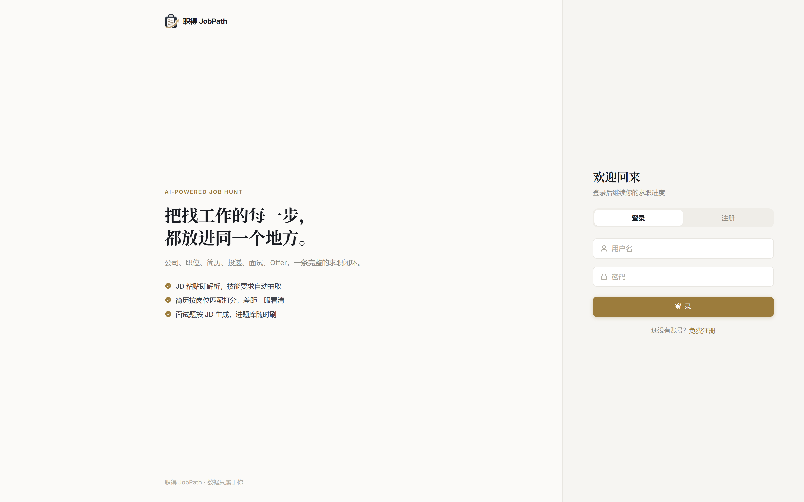
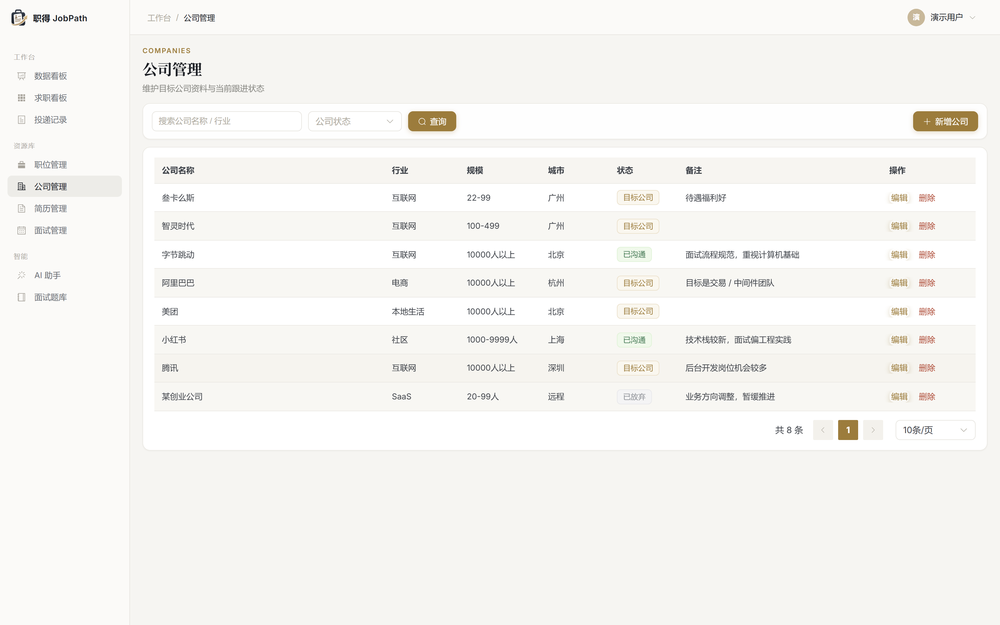
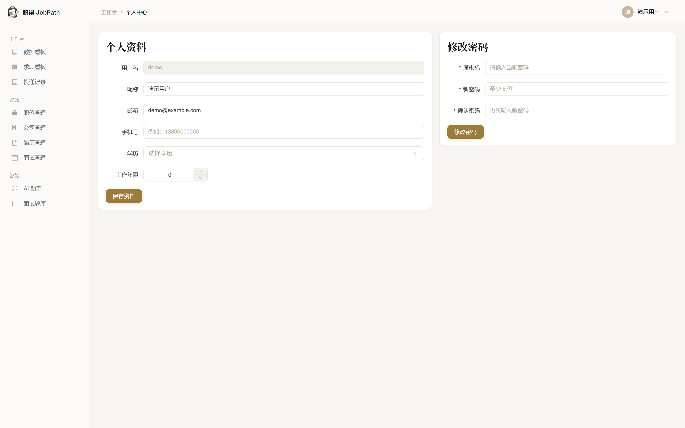

# AI 求职管理平台（AI Job Assistant）

一个把「找工作」全流程串起来的个人项目：**公司 → 职位 → 简历 → 投递 → 面试 → Offer**，
并接入大模型做 **JD 解析、简历匹配度分析、面试题生成**。

不是零散的功能堆砌，而是一条完整的求职闭环；也不只是一个 CRUD 系统 —— AI 结果会落库、
被引用、被统计，形成可回看的数据资产。

> 技术栈：Spring Boot 3 + MyBatis-Plus + MySQL 8 + Spring Security / JWT + Vue 3 + Element Plus + ECharts

---

## 目录

- [项目亮点](#项目亮点)
- [功能截图](#功能截图)
- [技术栈](#技术栈)
- [系统架构](#系统架构)
- [快速开始](#快速开始)
- [安全防护](#安全防护)
- [AI 能力说明](#ai-能力说明)
- [数据库设计](#数据库设计)
- [接口概览](#接口概览)
- [项目结构](#项目结构)
- [测试](#测试)
- [常见问题](#常见问题)
- [后续规划](#后续规划)

---

## 项目亮点

| 亮点 | 说明 |
| --- | --- |
| **完整业务闭环** | 投递记录是核心聚合根，串起公司、职位、简历、面试、AI 分析，而不是互不相干的单表 CRUD |
| **状态机驱动** | 投递有 7 个状态（收藏 / 已投递 / 笔试 / 面试 / Offer / 已拒绝 / 已放弃），新增面试会自动把投递推进到「面试」，标记面试未通过自动置为「已拒绝」，标记通过则会问一句「下一步」并按选择同步成 Offer 或自动建下一轮草稿 |
| **看板视图** | 7 列拖拽式求职看板（`/board`），一眼看清每个岗位卡在哪个环节 |
| **AI 降级设计** | 没配 `ai.api-key` 时自动走本地模拟引擎，用技术词典 + 正则做规则抽取，**输出结构与真实大模型完全一致**，项目开箱即可跑通全流程 |
| **AI 结果落库** | 每次 JD 解析 / 简历匹配都会写入 `ai_analysis`，生成的面试题会进题库，可回看、可统计 |
| **统一响应与异常** | `Result<T>` + `PageResult<T>` + `ErrorCode` 枚举 + 全局异常处理器，接口返回结构前后端一致 |
| **分层清晰** | `controller / service / service.impl / mapper / entity / dto / vo / ai / security / config / common`，DTO 与 VO 分离，实体不外泄 |
| **多租户数据隔离** | 所有业务查询都带 `user_id`，越权访问统一返回业务错误码，不会拿到别人的数据 |
| **简历文件导入** | 支持上传 PDF / DOCX / TXT 简历，后端抽文本后用规则引擎推断姓名、电话、邮箱、学历、工作年限、技能标签，回填表单、用户确认后再保存 |
| **简历专项优化** | 选好目标岗位后，把零散粘贴的项目经历按岗位逐条改写，输出「原文 → 改写 → 理由」对照和可直接使用的完整稿，还能另存为新简历版本而不动原稿 |
| **从职位直达投递** | 职位列表每行可以直接「投递」，自动带出默认简历，确认后跳看板并高亮新卡片，不用再切页面重选职位 |
| **简历效果分析** | 看板按简历版本统计投递数 / 面试数 / Offer 数与转化率（7 / 30 / 90 天），直接回答「哪份简历更有效」 |
| **复盘沉淀进题库** | 面试复盘写满 20 字就能一键交给 AI 拆成面试题，自动归入固定分类，下次面试前直接刷 |

---

## 功能截图

| 登录页 | 数据看板 |
| --- | --- |
|  |  |

| 求职看板 | 投递记录 |
| --- | --- |
|  |  |

| 职位管理 | 公司管理 |
| --- | --- |
|  |  |

| 简历管理 | 个人中心 |
| --- | --- |
|  |  |

| 面试管理 | 面试题库 |
| --- | --- |
|  |  |

| AI 助手（JD 解析 / 简历匹配 / AI 出题） |
| --- |
|  |

---

## 技术栈

### 后端

| 技术 | 版本 | 用途 |
| --- | --- | --- |
| Java | 17 | 语言版本（用到 record、switch 表达式、文本块） |
| Spring Boot | 3.2.5 | 基础框架 |
| Spring Security | 6.x | 认证与鉴权 |
| JJWT | 0.12.5 | JWT 生成与校验 |
| MyBatis-Plus | 3.5.5 | ORM、分页、逻辑删除 |
| MySQL | 8.0 | 数据库 |
| Knife4j (OpenAPI 3) | 4.5.0 | 接口文档 |
| Lombok | - | 简化样板代码 |
| Maven | 3.9 | 构建 |

### 前端

| 技术 | 版本 | 用途 |
| --- | --- | --- |
| Vue | 3.5 | 框架（组合式 API + `<script setup>`） |
| Vite | 5 | 构建工具 |
| Element Plus | 2.8 | UI 组件库 |
| Pinia | 2.x | 状态管理 |
| Vue Router | 4.x | 路由（hash 模式） |
| Axios | 1.x | HTTP 请求，拦截器统一注入 token |
| ECharts | 5.x | 趋势折线图、状态饼图、Top 公司柱状图 |

#### 界面与设计令牌

整体是「浅色侧边栏 + 冷灰底 + 白色卡片 + 蓝色强调」的风格，配色没有散落在各个组件里，而是收在两处：

- `assets/main.css`：CSS 变量定义设计令牌（品牌色、中性色、语义色、圆角、阴影），并覆盖 Element Plus 的 `--el-*` 变量，内置组件的主题跟着一起走；
- `utils/theme.js`：JS 侧的同一套色值，供 ECharts 和状态色使用，图表颜色不再各写一份 hex。

投递状态色通过 `statusColor(status)` 按状态码取值，饼图对每个数据项单独上色，因此不依赖后端返回的排序。

> 第一版**刻意没有引入 Redis / Docker / 消息队列**，目的是让项目 clone 下来就能跑通。
> 这些属于「后续规划」里的加分项，不是跑通全流程的必要条件。

---

## 系统架构

```
┌─────────────────────────────────────────┐
│              Vue 3 + Vite               │
│   登录 / 看板 / 公司 / 职位 / 简历 /     │
│   投递 / 面试 / 题库 / AI 助手 / 个人中心 │
└────────────────────┬────────────────────┘
                     │ HTTP + JWT
                     ▼
┌─────────────────────────────────────────┐
│            Spring Boot 3 (8088)         │
│                                         │
│  Controller ── DTO/VO ── 参数校验        │
│      │                                  │
│  Service ── 业务规则 / 状态机 / 事务      │
│      │            │                     │
│  Mapper      AiService ── AiClient      │
│  (MyBatis-    │            │            │
│   Plus)       │            ├─ 有 key → 大模型 API
│      │        │            └─ 无 key → MockAiEngine
│      ▼        ▼                         │
│   MySQL   ai_analysis / interview_question
│                                         │
│  Spring Security + JwtFilter ── 认证鉴权 │
│  GlobalExceptionHandler ── 统一异常      │
└─────────────────────────────────────────┘
```

---

## 快速开始

### 环境要求

- JDK 17 及以上
- Maven 3.8+
- MySQL 8.0+
- Node.js 18+ 与 npm

### 1. 初始化数据库

```bash
mysql -uroot -p < sql/schema.sql
```

脚本会创建 `ai_job_assistant` 数据库和 8 张表，可重复执行（会先 drop 再建）。

### 2. 启动后端

修改 `backend/src/main/resources/application.yml` 里的数据库账号密码（默认 `root/123456`）：

```yaml
spring:
  datasource:
    url: jdbc:mysql://localhost:3306/ai_job_assistant?...
    username: root
    password: 123456
```

然后启动：

```bash
cd backend
mvn spring-boot:run
```

或者打包后运行：

```bash
cd backend
mvn clean package -DskipTests
java -jar target/job-assistant-1.0.0.jar
```

后端跑在 **http://localhost:8088/api**，接口文档：**http://localhost:8088/api/doc.html**

> 端口用的是 8088 而不是 8080，因为 8080 经常被本地其它服务占用。
> 需要改端口就设环境变量 `SERVER_PORT=9090`。

### 3. 启动前端

```bash
cd frontend
npm install
npm run dev
```

浏览器打开 **http://localhost:5173**，注册一个账号即可开始使用。

### 4. 灌入演示数据（可选，但强烈建议）

空库时看板全是 0，看不出效果。启动后端后执行一次种子脚本：

```bash
# 首次：造 6 家公司 / 20 个职位 / 2 份简历 / 20 条投递 / 6 场面试
powershell -ExecutionPolicy Bypass -File scripts/seed-demo.ps1

# 想推倒重来
powershell -ExecutionPolicy Bypass -File scripts/seed-demo.ps1 -Reset
```

脚本会自动注册 `demo / 123456` 账号。它是**幂等**的：已存在的公司、职位、简历按名称复用，
不会重复插入；再次执行只会补齐缺失的数据。

灌完再在「AI 助手」页点几次「生成面试题」，题库也就有内容了。

### 5. 跑测试

```bash
cd backend
mvn test
```

当前 103 个用例全部通过，覆盖投递状态机、AI 返回内容解析、本地模拟引擎、
简历结构化解析、注册限流策略等核心点。

### 6. 分享给别人用（内网穿透）

本机就能当服务器用，不需要买云主机。一条命令搞定「打包前端 → 起网关 → 开隧道」：

```powershell
# Cloudflare Tunnel（推荐：地址固定、免费、自带 HTTPS）
powershell -ExecutionPolicy Bypass -File start-public.ps1 -Tunnel cloudflare

# 只用 cpolar（老方案，免费版地址会变）
powershell -ExecutionPolicy Bypass -File start-public.ps1 -Tunnel cpolar

# 不开隧道，仅本机
powershell -ExecutionPolicy Bypass -File start-public.ps1 -Tunnel none
```

脚本跑完会直接打印公网地址，发给他人在浏览器打开即可。

先把 cloudflared 装上（只需一次）：

```powershell
winget install --id Cloudflare.cloudflared
```

**想要固定地址**（推荐，临时地址每次重启都变）：

1. 准备一个域名，把 NS 托管到 Cloudflare（免费套餐即可）
2. 一次性配置，指定要用的子域名：

```powershell
powershell -ExecutionPolicy Bypass -File cloudflare-tunnel.ps1 -Action setup -Domain job.你的域名.com
```

3. 之后带域名启动，地址就固定了：

```powershell
powershell -ExecutionPolicy Bypass -File start-public.ps1 -Domain job.你的域名.com
```

4. 可选：装成 Windows 服务，开机自动拉起隧道（需管理员）

```powershell
powershell -ExecutionPolicy Bypass -File cloudflare-tunnel.ps1 -Action install-service
```

其它常用动作：`-Action quick`（免域名临时试跑）、`-Action status`（看隧道状态）、
`-Action uninstall-service`（卸载服务）。

> 前提是**本机开机 + 后端在跑**。关掉 PowerShell 窗口不影响服务，但关机就断了。

---

## 安全防护

### 注册限流

`RateLimitService` 是内存滑动窗口实现，只用来挡刷号，单机部署够用：

| 维度 | 默认阈值 | 说明 |
| --- | --- | --- |
| 注册 · 同 IP 短窗口 | 60 分钟内 3 次 | 挡住批量刷号 |
| 注册 · 同 IP 累计 | 最多 10 个账号 | 挡住慢速长期注册 |

**登录不做任何限流**：既不限频率也不做失败锁定。用户在自己电脑上反复试密码
不该被拦在门外，账号安全交给密码本身保证。

超过阈值统一返回 `1007 操作太频繁，请稍后再试`。真实 IP 通过
`IpUtils` 按 `CF-Connecting-IP → X-Real-IP → X-Forwarded-For` 优先级提取，
所以挂在 Cloudflare Tunnel 或 Nginx 后面也能拿到访客真实 IP。

阈值都可在 `application.yml` 的 `rate-limit.*` 调整，或直接用环境变量覆盖：

```bash
RATE_LIMIT_ENABLED=true
RATE_LIMIT_REGISTER_MAX=3          # 注册窗口内次数
RATE_LIMIT_REGISTER_TOTAL=10       # 注册累计上限
```

做成多实例集群时需要把计数器换成 Redis 实现，`RateLimitService` 的接口不用动。

### 单点登录

同一个账号不允许在两个浏览器同时在线。JWT 里带 `tokenId`，每次登录都会刷新它，
旧 token 随即失效——在新设备登录会把老设备踢下线。

---

## AI 能力说明

四个 AI 功能都在 `AiService` 里，提示词集中在 `AiPrompts`，要求模型**只返回 JSON**，
后端用 Jackson 反序列化成 `record`，再落库 —— 而不是拿一段自然语言去正则抠字段。

### 1. JD 解析

输入一段职位描述，输出结构化结果：

```json
{
  "skills": ["Java", "Spring Boot", "MySQL", "Redis"],
  "experience": "3-5年",
  "education": "本科",
  "keywords": ["微服务", "分布式系统", "高并发"],
  "responsibilities": ["负责核心业务系统的后端设计与开发"]
}
```

### 2. 简历匹配度分析

输入「简历 + JD」，输出匹配分与改进建议：

```json
{
  "score": 82,
  "matchedSkills": ["Java", "Spring Boot", "MySQL"],
  "missingSkills": ["Redis", "Kafka"],
  "strengths": ["Java 项目经验较丰富"],
  "suggestions": ["补充 Redis 项目经验", "强化高并发场景描述"]
}
```

前端会把 `score` 按区间染成不同颜色，缺失技能用红色 tag 标出来。

### 3. 面试题生成

输入「JD + 简历 + 岗位名称」，按分类批量出题，可一键存入题库：

分类固定为 7 个：编程语言与基础 / 框架与中间件 / 数据库与缓存 / 系统设计与性能 / 测试与质量 / 项目与业务 /
HR与软素质。出题时只允许从这 7 个里选，模型返回的分类名还会在落库前再归一化一次
（例如 `项目深挖` → `项目与业务`、`MySQL`/`Redis` → `数据库与缓存`），
避免同一个技术方向被拆成好几个分类。

```json
{
  "questions": [
    {
      "category": "Redis",
      "question": "Redis 缓存击穿和缓存穿透有什么区别？",
      "difficulty": "MEDIUM",
      "answer": "..."
    }
  ]
}
```

### 4. 简历专项优化

输入「目标岗位 + 用户粘贴的原始素材（项目经历、工作内容、技能）」，输出逐条改写对照与完整优化稿：

```json
{
  "rewrites": [
    {
      "section": "项目经历",
      "original": "1. 负责订单系统的重构，引入 Redis 缓存后接口耗时从 800ms 降到 120ms",
      "optimized": "主导订单系统的重构，引入 Redis 缓存后接口耗时从 800ms 降到 120ms",
      "reason": "句首「负责」偏弱，换成结果导向的动词更有说服力"
    }
  ],
  "matchedKeywords": ["Java", "Spring Boot", "MySQL", "Redis"],
  "missingKeywords": ["Kafka", "分布式系统"],
  "suggestions": ["补充「Kafka」相关的项目产出，写清你负责的部分和最后的结果"],
  "optimizedContent": "技能：Spring Boot、MyBatis、Redis、MySQL\n项目经历：\n- 主导订单系统的重构……",
  "comment": "共改写 2 条，命中岗位关键词 6/13 个。"
}
```

几个刻意的设计：

- **不允许编造**：提示词明确禁止模型编造公司、项目和数字，缺数据的地方让它写「【待补充：xxx】」占位，由用户自己填；
- **改了什么要说得清**：`original` 逐字保留原文，只有 `optimized` 做修改，`reason` 解释改法，前端并排展示成对照卡片；
- **另存而不是覆盖**：`save=true` 时把优化稿存成一份新简历（标题自动带上岗位名），原简历一个字段都不动；
- **本地引擎同样守规矩**：没配 API Key 时按「弱动词替换 + 缺量化提示」的规则改写，同样只换表达、不造事实。

### 5. 简历结构化与 A4 排版

「简历管理」里导入的简历只是一段纯文本，而且 PDF 复制出来的顺序是乱的——板块标题经常被挤到
所属内容的**后面**，没法直接排版。`/ai/structure-resume` 把它识别成固定结构：

```json
{
  "basics": { "name": "吴锦炎", "label": "软件测试", "phone": "132…", "email": "…", "city": "广州", "workYears": "应届生", "summary": "…" },
  "education": [{ "school": "广东科技学院", "major": "软件工程", "degree": "本科", "period": "2022-09 ~ 2026-07", "detail": "专业成绩：GPA 3.66/4" }],
  "work": [{ "company": "百度", "position": "软件测试实习生", "period": "2025-09 ~ 2026-01", "bullets": ["负责 Web 端与移动端产品的功能测试……"] }],
  "projects": [{ "name": "智慧云课堂教育管理平台", "role": "软件测试实习生", "period": "…", "summary": "基于 Spring Boot 微服务架构……", "bullets": ["全流程功能测试：……"] }],
  "skills": ["熟悉UI自动化测试……"],
  "honors": ["软件设计师中级证书"]
}
```

几个刻意的设计：

- **标题排在前面还是后面都能认**：`ResumeStructureParser` 会把两种排布各解析一遍，用板块关键词打分挑更像的那一种（PDF 导入的简历基本都是「标题后置」）；
- **硬换行合并、编号去掉**：一句话被拆成两行时拼回一条，形如「1.」「2、」「-」的编号前缀一律去掉；
- **图标字体先清掉**：简历模板里的小图标在 PDF 里是私用区字符（U+E000–U+F8FF），复制出来就是乱码方块，解析前统一剔除，否则一个板块都认不出来；
- **不编造**：原文没有的字段留空，宁可少字段也不替用户填；
- **可以在模板上直接改**：点「编辑模板」后 A4 纸上的每个字段都变成输入框，能改文字、加删条目（项目 / 工作 / 技能 / 荣誉都可以），改完点「保存修改」写回 `content_json`，点「放弃修改」丢掉这次改动；编辑时「打印 / 导出 PDF」置灰，避免把输入框带上纸；
- **可以加自己的板块**：内置板块之外还能「+ 添加自定义板块」（校园经历、证书奖项、个人作品…），标题和条目都能改，写进 `content_json.sections`，下次打开直接复用；
- **条目可拖拽排序**：工作 / 项目 / 教育 / 技能 / 荣誉 / 自定义板块，以及板块内的每一条，左侧都有 ⠿ 手柄，按住拖动即可换位置，顺序同样存进 `content_json`；
- **基本信息同步**：保存时把纸上的姓名 / 电话 / 邮箱 / 学历 / 个人简介同步回简历字段，简历列表卡片跟着更新；
- **导出 PDF 走浏览器原生打印**：`ResumeSheet.vue` 按 A4 尺寸排版，`@media print` 只保留这张纸，用系统打印对话框「另存为 PDF」，文字可选、对 ATS 友好。

### 接入真实大模型

登录后进入「AI 助手」，点击右上角「配置模型」，即可为当前账号填写厂商、API 模式、
Base URL、模型名和 API Key。支持 OpenAI、DeepSeek、通义千问兼容模式、Moonshot、
Ollama 以及自定义 OpenAI 兼容服务。

- **Chat Completions**：调用 `{baseUrl}/chat/completions`；
- **Responses**：调用 `{baseUrl}/responses`；
- **Base URL**：只填到版本前缀即可（例如 `https://api.openai.com/v1`）。如果从厂商文档里
  复制了完整地址（`.../v1/models`、`.../v1/chat/completions`），后端会先剥掉末尾的端点路径，
  不会再拼出 `/v1/models/models`；
- **拉取模型**：`GET {baseUrl}/models`，失败信息会带上真实请求地址和底层原因（DNS / 连接超时 /
  读超时 / TLS），方便判断是地址写错还是网络不通。OpenAI 官方地址在国内需要代理才能直连；
  后端启动时会自动检测 Windows 系统代理：用户本机开了 Clash / V2Ray 等系统代理即可自动生效，无需手动配置；
  如自动检测失败，也可通过环境变量 `AI_PROXY_HOST=127.0.0.1` 和 `AI_PROXY_PORT=7897` 强制指定；
- **思考模式**：`跟随厂商 / 关闭 / 开启`。关闭时 Chat 协议传 `thinking.type=disabled`、
  Responses 协议传 `reasoning.effort=none`；开启会输出思维链，输出 token 明显变多；
- **单价**：可选，单位「元 / 百万 tokens」（输入、缓存命中、输出三项）。填了才会在每个结果
  下方显示预估费用，留空只显示 token 数；
- API Key 使用 AES-256-GCM 加密后按用户保存，前端只能读取掩码；
- 生产环境必须设置 `AI_CONFIG_ENCRYPTION_KEY`，且部署后不要随意更换，否则旧密钥无法解密。

每次调用都会解析厂商返回的 `usage`，在结果下方展示输入 / 输出 / 缓存命中 / 思维链 token 数，
并写入 `ai_analysis`，可在历史记录里回看（DeepSeek 的 `prompt_cache_hit_tokens`、
`input_tokens_details.cached_tokens` 等字段都会被识别，缺字段不影响调用）。

老数据库需要先执行一次非破坏性迁移：

```bash
mysql -uroot -p < sql/migrations/V2__ai_user_config.sql
mysql -uroot -p < sql/migrations/V3__ai_usage_and_pricing.sql
mysql -uroot -p < sql/migrations/V4__normalize_question_category.sql
mysql -uroot -p < sql/migrations/V5__fill_missing_question_category.sql
mysql -uroot -p < sql/migrations/V6__resume_content_json.sql
mysql -uroot -p < sql/migrations/V7__user_token_id.sql
mysql -uroot -p < sql/migrations/V8__job_salary_desc.sql
```

任何兼容 OpenAI 协议的服务都能用（OpenAI / DeepSeek / 通义千问兼容模式 / 本地 Ollama）。
改 `application.yml` 或直接用环境变量：

```bash
# 方式一：环境变量（推荐，不要把 key 写进代码库）
set AI_API_KEY=sk-xxxxxxxx
set AI_BASE_URL=https://api.deepseek.com/v1
set AI_MODEL=deepseek-chat

# 方式二：改 application.yml 的 ai.* 节点
```

配好之后重启后端，前端右上角的标签会从「本地模拟引擎」自动变成「大模型 xxx」。
（这个判断来自 `GET /ai/config` 接口，不是前端猜的。）

### 本地模拟引擎（MockAiEngine）

`ai.api-key` 为空时，`AiClient` 会走 `MockAiEngine`：用一份技术关键词词典 + 正则，
从 JD 和简历里抽取技能、经验、学历、关键词，再按规则算匹配分、拼装面试题。

它的意义是：**clone 下来不配任何 key 也能把整条 AI 链路跑通**，方便演示和联调；
等你配好 key，业务代码一行都不用改。

---

## 数据库设计

8 张表，全部带 `created_at / updated_at / deleted`（逻辑删除）。

```
user
 ├── resume            简历（一个用户多份，可设默认）
 ├── company           公司
 │    └── job          职位（挂公司，存 JD 全文）
 │         └── application   投递记录（聚合根：关联职位 + 简历）
 │              └── interview        面试（多轮，带结果与复盘）
 ├── ai_analysis       AI 分析结果（JD 解析 / 简历匹配）
 └── interview_question 面试题库
```

### 投递状态机

```
WISHLIST ──> APPLIED ──> WRITTEN_TEST ──> INTERVIEW ──> OFFER
                 └────────────┴──────────────┴──> REJECTED / CLOSED
```

| 状态 | 含义 |
| --- | --- |
| `WISHLIST` | 已收藏，还没投 |
| `APPLIED` | 已投递 |
| `WRITTEN_TEST` | 笔试 |
| `INTERVIEW` | 面试中 |
| `OFFER` | 拿到 Offer |
| `REJECTED` | 被拒绝 |
| `CLOSED` | 主动关闭 |

这套状态直接驱动看板列顺序、状态分布饼图，以及「面试率 / Offer 率」的统计口径。

---

## 接口概览

统一前缀 `/api`，统一响应结构 `{ code, message, data }`，除注册登录外都需要
`Authorization: Bearer <token>`。完整文档见 **http://localhost:8088/api/doc.html**(Knife4j)。

| 模块 | 方法 | 路径 | 说明 |
| --- | --- | --- | --- |
| 认证 | POST | `/auth/register` | 注册 |
| 认证 | POST | `/auth/login` | 登录，返回 JWT |
| 认证 | GET | `/auth/me` | 当前用户信息 |
| 认证 | PUT | `/auth/profile` | 修改个人资料 |
| 认证 | PUT | `/auth/password` | 修改密码 |
| 公司 | GET | `/companies` | 分页查询 |
| 公司 | GET | `/companies/all` | 全部（下拉框用） |
| 公司 | POST / PUT / DELETE | `/companies[/{id}]` | 增改删 |
| 职位 | GET | `/jobs` | 分页 + 关键字/公司/状态筛选 |
| 职位 | POST / PUT / DELETE | `/jobs[/{id}]` | 增改删 |
| 简历 | GET | `/resumes` `/resumes/all` | 分页 / 全部 |
| 简历 | POST / PUT / DELETE | `/resumes[/{id}]` | 增改删 |
| 简历 | PUT | `/resumes/{id}/default` | 设为默认简历 |
| 简历 | POST | `/resumes/import` | 上传 PDF / DOCX / TXT 简历，解析成「新增简历」表单字段（不落库） |
| 投递 | GET | `/applications` | 分页 + 状态筛选，卡片带下次面试时间与最近匹配分 |
| 投递 | GET | `/applications/board` | 看板数据（按状态分组） |
| 投递 | GET | `/applications/statuses` | 状态枚举与中文名 |
| 投递 | POST / PUT / DELETE | `/applications[/{id}]` | 增改删 |
| 面试 | GET | `/interviews` | 分页查询，`upcomingDays=7` 只看未来 7 天（首页红点用） |
| 面试 | GET | `/interviews/upcoming` | 即将到来的面试 |
| 面试 | POST / PUT / DELETE | `/interviews[/{id}]` | 增改删；PUT 结果改为「通过」时返回 `awaitingNextStep`，带 `nextStep=OFFER/NEXT_ROUND` 落库用户选择 |
| 题库 | GET | `/questions` | 分页 + 分类/难度/掌握筛选 |
| 题库 | GET | `/questions/categories` | 分类列表 |
| 题库 | GET | `/questions/category-stats` | 每个分类的题数与已掌握数（题库首页分类卡片） |
| 题库 | GET | `/questions/category-options` | 固定分类列表（AI 出题可选范围） |
| 题库 | DELETE | `/questions[/{id}]` | 删题 / 清空 |
| AI | POST | `/ai/analyze-jd` | JD 解析 |
| AI | POST | `/ai/match-resume` | 简历匹配度 |
| AI | POST | `/ai/generate-questions` | 生成面试题 |
| AI | POST | `/ai/extract-questions` | 从面试复盘文本提取题目入题库 |
| AI | POST | `/ai/optimize-resume` | 简历专项优化（按岗位改写素材，可另存为新简历） |
| AI | POST | `/ai/structure-resume` | 简历结构化（纯文本识别成 A4 排版用的固定结构，结果写回 resume.content_json） |
| AI | GET | `/ai/history` | AI 分析历史 |
| AI | GET | `/ai/config` | 当前 AI 配置（模型 / 是否 mock） |
| 看板 | GET | `/dashboard` | 首页统计 + 趋势 + 分布 + Top 公司 |
| 看板 | GET | `/dashboard/home` | 首页聚合数据 |
| 看板 | GET | `/dashboard/resume-performance` | 简历版本效果分析（投递数 / 面试率 / Offer 率，`days=7/30/90`） |

---

## 项目结构

```
ai-job-assistant/
├── sql/
│   └── schema.sql                 # 8 张表的建表脚本
├── scripts/
│   ├── seed-demo.ps1              # 幂等的演示数据种子脚本
│   ├── smoke-prd.ps1              # 按产品需求文档逐项冒烟（跑完自动清理数据）
│   └── make-screenshots.cjs       # 重新生成 README 功能截图（需后端 + 网关在跑）
├── docs/
│   └── screenshots/               # README 用到的截图
├── backend/
│   ├── pom.xml
│   └── src/
│       ├── main/
│       │   ├── java/com/jobassistant/
│       │   │   ├── JobAssistantApplication.java
│       │   │   ├── common/        # Result / PageResult / ErrorCode / 状态常量 / 业务异常
│       │   │   ├── config/        # Security / MyBatis-Plus / Knife4j / Jackson / 配置属性
│       │   │   ├── security/      # JwtUtils / JwtAuthenticationFilter / LoginUser / SecurityUtils
│       │   │   ├── controller/    # 8 个 Controller
│       │   │   ├── service/       # 业务接口
│       │   │   │   └── impl/      # 业务实现（含状态机与事务）
│       │   │   ├── mapper/        # MyBatis-Plus Mapper
│       │   │   ├── entity/        # 数据库实体
│       │   │   ├── dto/           # 入参对象（带 @Valid 校验）
│       │   │   ├── vo/            # 出参对象（含 DashboardVO / JdAnalysisVO 等）
│       │   │   ├── ai/            # AiClient / AiPrompts / MockAiEngine
│       │   │   └── exception/     # 全局异常处理器
│       │   └── resources/
│       │       └── application.yml
│       └── test/java/com/jobassistant/
│           ├── common/ApplicationStatusTest.java   # 投递状态机
│           └── ai/AiClientTest.java                # AI 返回内容解析
│           └── ai/MockAiEngineTest.java            # 本地模拟引擎
└── frontend/
    ├── package.json
    ├── vite.config.js
    └── src/
        ├── api/                   # request.js 拦截器 + index.js 全部接口封装
        ├── router/                # 路由与登录守卫
        ├── store/                 # Pinia
        ├── utils/                 # theme.js 统一调色板（图表 / 状态色 / 评分色）
        ├── assets/main.css        # 设计令牌 + Element Plus 主题覆盖
        ├── components/AppLayout.vue
        └── views/                 # 11 个页面
```

### 前端页面

| 路由 | 页面 | 说明 |
| --- | --- | --- |
| `/login` | 登录页 | 登录 / 注册双 Tab |
| `/dashboard` | 数据看板 | 统计卡 + 30 天趋势 + 状态分布 + Top 公司 + 近期面试 |
| `/companies` | 公司管理 | 公司列表与状态维护 |
| `/jobs` | 职位管理 | 职位列表，每行可直接「投递」（带出默认简历，成功后跳看板高亮新卡片），含「AI 解析」侧边抽屉 |
| `/resumes` | 简历管理 | 卡片式多版本简历，支持导入 PDF / DOCX / TXT 解析后回填 |
| `/applications` | 投递记录 | 表格 + 状态流转 |
| `/board` | 求职看板 | 7 列看板，卡片显示距今投递天数 / 下次面试时间 / AI 匹配分，可直接改状态 |
| `/interviews` | 面试管理 | 面试安排与复盘，结果改「通过」会问下一步，复盘可一键提取到题库 |
| `/questions` | 面试题库 | 首页按分类平铺成卡片，点进分类才是题目列表，可标记已掌握 |
| `/ai` | AI 助手 | JD 解析 / 简历匹配 / 简历优化 / 简历排版 / AI 出题 五个 Tab |
| `/dashboard` | 数据看板 | 统计卡 + 趋势 + 分布 + 7 天内面试红点 + 简历效果分析报表 |
| `/profile` | 个人中心 | 资料与密码修改 |

---

## 测试

### DeepSeek 只读辅助工具

项目内置了 `scripts/ask-deepseek.ps1`，用于把搜索、调用链整理、日志归纳等简单杂活交给
CC Switch 的 Codex 供应商，核心判断和代码修改仍由 GPT 完成。默认读取
`Codex → 公司01`，不会切换 CC Switch 当前供应商：工具会创建一次性的独立 `CODEX_HOME`，
以 `read-only` 沙箱运行 `codex exec --ephemeral`，结束后立即清理临时认证文件。

前置条件：本机已安装 Python 3、Codex CLI，并已在 CC Switch 的 Codex 标签下保存“公司01”。

```powershell
powershell -ExecutionPolicy Bypass -File scripts/ask-deepseek.ps1 `
  -Task "只读分析登录超时相关调用链，返回文件路径、行号和关键结论"
```

结果默认写入 `.ai-handoff/deepseek-result.md`，最多保留 1500 个字符。可以调整供应商、
长度和输出位置：

```powershell
./scripts/ask-deepseek.ps1 `
  -Task "归纳最近一次测试失败的共同原因" `
  -Provider "公司01" `
  -MaxChars 1000 `
  -Output ".ai-handoff/test-failures.md"
```

工具只在运行时从 CC Switch 数据库读取供应商配置。API Key 不会写入项目、交接结果或命令行；
Codex 执行失败时，错误输出中的供应商密钥也会被替换为 `[REDACTED]`。

单元测试集中在「容易出错、又不需要启动容器」的地方，跑起来很快（约 7 秒）：

| 测试类 | 覆盖内容 |
| --- | --- |
| `ApplicationStatusTest` | 状态合法性校验、中文标签、看板列顺序、WISHLIST 不计入投递数 |
| `AiClientTest` | 大模型返回内容解析：纯 JSON、```json 代码块、前后带说明文字、无 JSON 时报错 |
| `MockAiEngineTest` | JD 技能/经验/学历抽取、长词优先（JavaScript 不误判成 Java）、匹配分、按分类出题、简历按岗位逐条改写（不编数据、缺量化给占位） |
| `QuestionCategoryTest` | 题库分类归一化：同义分类合并、关键词冲突优先级、幂等、排序 |
| `QuestionServiceImplTest` | 题库分类统计按固定顺序返回，未知分类排在最后，空题库不报错 |
| `ResumeFieldExtractorTest` | 中文简历字段抽取：姓名 / 电话 / 邮箱 / 学历 / 工作年限 / 求职意向 / 技能边界 / 空文本兜底 |
| `ResumeStructureParserTest` | 简历结构化：标题排在正文后面的 PDF 排版、硬换行合并、编号去掉、缺字段不编造、标题与正文挤在一行、图标字体私用区字符清理，含真实 PDF 简历回归（`src/test/resources/resume-sample-pdf.txt`） |
| `ResumeImportServiceImplTest` | 简历文件导入：DOCX 解析、GBK txt 兜底、`.doc` 明确提示、扫描件无文字报错、10MB 上限 |
| `GlobalExceptionHandlerTest` | 访问不存在的路径返回 404「接口不存在」，不会被 500 兜底吞掉 |

```bash
cd backend && mvn test
```

### 冒烟测试

接口级的冒烟脚本，按产品需求文档逐项验证（投递 → 面试流转 → 报表 → 复盘入题库），
跑之前确保后端起在 `8088`：

```bash
pwsh -ExecutionPolicy Bypass -File scripts/smoke-prd.ps1
```

脚本用演示账号跑真接口，造出来的职位 / 投递 / 面试 / 题目在结束时会被清理掉，
不会污染演示数据。前端工具函数另有一组 `node:test` 单测：

```bash
cd frontend && node --test tests/datetime.test.mjs
```

> 这些用例不依赖 MySQL 和 Spring 容器，所以 CI 里不需要额外起服务。
> 需要数据库的集成测试建议后续用 Testcontainers 补，见下方规划。

---

## 常见问题

**Q：启动报 `Unknown database 'ai_job_assistant'`**
先执行 `mysql -uroot -p < sql/schema.sql` 建库建表。

**Q：接口返回 500，日志里是 `HttpMessageNotReadableException`**
日期字段格式不对，统一用 `yyyy-MM-dd HH:mm:ss`。注意 Spring Boot 的
`spring.jackson.date-format` 对 `LocalDateTime` **不生效**，本项目在
`JacksonConfig` 里显式注册了 JSR-310 序列化器，如果你自己改了这块要留意。

**Q：不配 AI key 能用吗？**
能。会自动走本地模拟引擎，四个 AI 功能都能出结果，只是内容质量不如真实模型。

**Q：刚加的后端接口，点了报「系统开小差了」，日志里是 `NoResourceFoundException`？**
说明这个路径在**正在运行的进程里根本不存在**，通常是后端还跑着旧版本：前端 `npm run dev`
会热更新，后端不会。改完后端代码要「停掉后端 → `mvn clean package -DskipTests` → 重新启动」
才会生效（jar 被运行中的进程占用时 `clean` 会失败，所以必须先停）。
现在这类请求会明确回 `404 接口不存在：/api/xxx`，不再伪装成 500。

**Q：导入简历提示格式不支持，或者读不出文字？**
只支持 PDF / DOCX / TXT（含 `.md`），且必须是文字版：扫描件（图片型 PDF）、加密 PDF
和 `.doc` 老格式都不行，用 Word 另存为 `.docx` 或 PDF 再试。单文件上限 10MB。

**Q：为什么没有 Redis / Docker？**
第一版的目标是「开箱即跑、跑通闭环」。这些是加分项，见下面的后续规划。

**Q：中文在 PowerShell 控制台显示成乱码？**
控制台编码问题，数据库里存的是正常的。种子脚本已经改成手动按 UTF-8 解码响应，
脚本自身的输出是正常的。

---

## 后续规划

按「性价比」排序，前几项投入小、面试时也比较好讲：

- [ ] **Redis 缓存**：缓存看板统计、题库分类，加分布式锁防止 AI 接口被重复触发
- [ ] **定时任务**：面试前一天自动提醒（`@Scheduled` 或延迟队列）
- [x] **简历文件导入**：上传 PDF / DOCX / TXT 自动抽取文本并推断字段，省掉手动粘贴
- [x] **简历专项优化**：按目标岗位逐条改写项目经历，输出对照稿并可另存为新简历版本
- [ ] **AI 模拟面试**：多轮对话式追问，结合历史答题情况动态调整难度
- [ ] **求职周报**：每周汇总投递量、面试转化率变化，邮件推送
- [ ] **岗位关键词统计**：把 JD 解析出的技能词做聚合，看出市场最缺什么
- [ ] **投递效果分析**：按公司 / 渠道 / 简历版本统计转化率，找出哪份简历最好用
- [ ] **Docker Compose 一键启动** + GitHub Actions CI
- [ ] **集成测试**：用 Testcontainers 起一个 MySQL，覆盖 Service 层和接口层的完整链路

---

## License

MIT，随便用。
